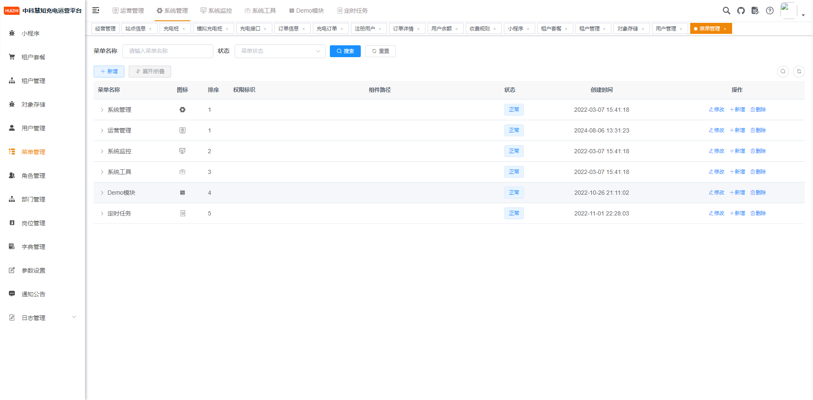
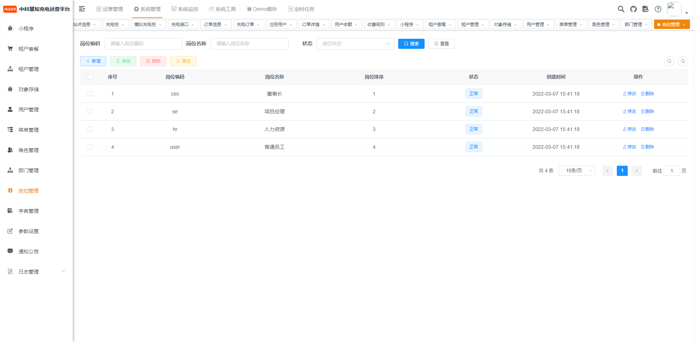

[🔥 Github的代码优先于Gitee   https://github.com/roinli/huige-ChargeOS-cloud](https://github.com/roinli/huige-ChargeOS-cloud)


原地址不明原因被禁用，该库为镜像项目

## 开源版本一定不会很完美，不过会一直持续更新，如果遇到任何问题请提issue或者加群沟通解决，谢谢。

## 社区版

#### - 微信讨论群：jinglidream (进群前，请在网页右上角点star)
#### - 数据库初始化SQL文件；模拟桩模块代码；，请进入讨论交流群，群文件自行下载，欢迎讨论与交流


当前版本：3.0.8
   
[🔥 充电平台微服务源码](https://github.com/roinli/huige-ChargeOS-cloud)（当前）
   
[🔥 充电管理后台前端源码](https://github.com/roinli/HUIZHI-ChargeOS-admin)
   
[🔥 充电小程序源码](https://github.com/roinli/HUIZHI-ChargeOS-mini) 

[🔥 更新日志](https://blog.csdn.net/Roinli?spm=1000.2115.3001.5343) 
<div align="center">

##   （慧哥）慧知开源充电桩平台

</div>

<div align="center" >
    <a href="http://wenhui.huizhidata.com">
        
    </a>
    <a href="http://wenhui.huizhidata.com">
        
    </a>
     <a href="https://github.com/roinli/huige-ChargeOS-cloud/repository/archive/master.zip">
        
    </a>
</div>

#### 

<div  align="center" >

[官网](http://wenhui.huizhidata.com/) |
[在线体验](http://hzqc-pc.huizhidata.com/) |
[帮助文档](http://doc.huizhidata.com) |

[comment]: <> ([宽屏预览]&#40;https://github.com/roinli/huige-ChargeOS-cloud/blob/master/README.md&#41;)
</div>
<div align="left" >
<a href="https://github.com/roinli/huige-ChargeOS-cloud/blob/master/README.md">宽屏预览</a>
</div>


---


### 📋 更新说明

```
V3.0.8 更新说明
1、全面拥抱微服务| 支持多租户 
2、全面拥抱引入时序数据库 
3、支持中电联互联互通协议
4、支持多租户 
5、支持尖峰平谷
6、支持设备管理
7、支持设备端口
8、支持操作日志
9、支持登录日志
10、支持多个小程序
11、对象存储（阿里oss、腾讯cos、七牛云kodo等）
12、经营大屏

......

```
### 用心做开源，我们也很需要你的鼓励！右上角Star🌟，等你点亮！

---

### 📝 介绍
（慧哥）慧知开源充电桩平台是一款全开源可商用的系统，前后端分离开发，在小程序、公众号、H5、APP、PC端都能用，使用方便，二开方便！安装使用也很简单！使用文档、接口文档、数据字典、二开文档，就算你是技术小白，也能轻松上手！

欢迎大家来体验、来提建议，来一起让 慧知开源充电桩平台 更强大，让更多开发者受益！虽然是开源，但我们该有的功能全都有！

慧知开源充电桩平台 hcp-cloud 是一个基于 Spring Cloud 微服务架构的开源充电桩运营平台，专为现代化充电桩管理和运营需求设计。该平台包含两个主要部分：运营管理端和小程序端，旨在提供灵活、高效、可扩展的解决方案，助力企业和服务提供商简化充电桩运营管理。  

#### 📝 核心功能：
* 微服务架构：基于 Spring Cloud 的微服务架构，hcp-cloud 能够实现各模块的独立部署和扩展，提升系统的可靠性和可维护性，同时支持弹性伸缩，适应多变的市场需求。
* 多租户支持：平台支持多租户架构，使得多个组织可以在同一平台上安全地独立运营，资源共享的同时确保数据隔离。
* 多个小程序支持：hcp-cloud 可支持多个小程序的接入，为不同的用户群体提供定制化服务，提高用户体验和运营效率。
* 分段计价：充电桩分段计价功能支持根据充电时段和功率的不同进行灵活定价，满足多样化的市场需求。
* 模拟充电桩：内置充电桩模拟功能，便于测试和调试，确保在上线前能够有效识别和解决潜在问题。
* 互联互通与协议支持：平台兼容多种通用监管协议和互联互通标准，确保与各类充电桩设备和其他平台的无缝对接，助力实现广泛的生态互联。

### 🖥 +v:18601938676 如果您也对开源感兴趣，欢迎加入群 ,加群请注明原因，开源、共享、共赢永远是主旋律。


### 📝 技术介绍

| 功能介绍    | 使用技术                | 文档地址                                                                                                     | 描述                                                                                                                                              |
|---------|---------------------|----------------------------------------------------------------------------------------------------------|-------------------------------------------------------------------------------------------------------------------------------------------------|
| 原框架     | vctgo-cloud         | [vctgo-plus](https://doc.vctgo.cn/)                                                                      | 定期同步需要的功能                                                                                                                                       |
| 前端开发框架  | Vue2、Element UI     | [Element UI官网](https://element.eleme.io/)                                                                | 一套为开发者、设计师和产品经理准备的基于 Vue 2.0 的组件库                                                                                                                                    |
| 后端开发框架  | SpringBoot          | [SpringBoot官网](https://spring.io/projects/spring-boot/#learn)                                            |                                                                                                                                                 |
| 关系数据库   | MySQL               | [MySQL官网](https://dev.mysql.com/)                                                                        | 适配 8.X 最低 5.7，可同时使用异构切换                                                                                                                         |
| 缓存数据库   | Redis               | [Redis官网](https://redis.io/)                                                                             | 支持 Redis 5-7 支持大部分新功能特性 如 分布式限流、分布式队列                                                                                                           |
| Redis客户端 | Redisson            | [Redisson官网](https://redisson.org/)                                                                      | 采用 Redisson Redis官方推荐 基于Netty的客户端工具<br/>支持Redis 90%以上的命令 底层优化规避很多不正确的用法 例如: keys被转换为scan<br/>支持单机、哨兵、单主集群、多主集群等模式                               |
| 缓存注解    | Spring-Cache        | [Spring Cache文档](https://spring.io/guides/gs/caching/)                                                   | 采用 Spring-Cache 注解 对其扩展了实现支持了更多功能<br/>例如 过期时间 最大空闲时间 组最大长度等 只需一个注解即可完成数据自动缓存                                                                    |
| 数据库框架   | Mybatis-Plus        | [Mybatis-Plus文档](https://baomidou.com/guide/)                                                            | 采用 Mybatis-Plus 基于对象几乎不用写SQL全java操作 功能强大插件众多<br/>例如多租户插件 分页插件 乐观锁插件等等                                                                           |
| 数据库框架   | p6spy               | [p6spy官网](https://p6spy.readthedocs.io/)                                                                 | 采用 p6spy 可输出完整SQL与执行时间监控                                                                                                                        |
| 多数据源框架  | dynamic-datasource  | [dynamic-ds文档](https://www.kancloud.cn/tracy5546/dynamic-datasource/content)                             | 采用 dynamic-datasource 支持世面大部分数据库<br/>通过yml配置即可动态管理异构不同种类的数据库 也可通过前端页面添加数据源<br/>支持spel表达式从请求头参数等条件切换数据源                                          |
| 序列化框架   | Jackson             | [Jackson官网](https://github.com/FasterXML/jackson)                                                        | 统一使用 jackson 高效可靠                                                                                                                               |
| 分布式队列   | Redisson            | [Redisson文档](https://github.com/redisson/redisson/wiki/%E7%9B%AE%E5%BD%95)                               | 普通队列、延迟队列、优先队列 等                                                                                                                                |
| 分布式锁    | Lock4j              | [Lock4j官网](https://gitee.com/baomidou/lock4j)                                                            | 注解锁、工具锁 多种多样                                                                                                                                    |
| 分布式事务框架 | sSeata              | [Seata文档](https://seata.apache.org/zh-cn/)                                                               | 微服务架构下提供高性能和简单易用的分布式事务服务。                                                                                                                                        |
| 监控框架    | SpringBoot-Admin    | [GItHub](https://github.com/codecentric/spring-boot-admin)                                               | 采用 SpringBoot-Admin 基于SpringBoot官方 actuator 探针机制<br/>实时监控服务状态 框架还为其扩展了在线日志查看监控                                                                  |
| 分布式链路追踪 | Apache SkyWalking   | [Apache SkyWalking文档](https://skywalking.apache.org/docs/)                                               | 链路追踪、网格分析、度量聚合、可视化                                                                                                                              |
| 云存储     | x-file-storage      | [c-file-storage使用文档](https://x-file-storage.xuyanwu.cn/#/) | 一行代码将文件存储到本地、FTP、SFTP、WebDAV、阿里云 OSS、华为云 OBS、七牛云 Kodo、腾讯云 COS、百度云 BOS、又拍云 USS、MinIO、 Amazon S3、GoogleCloud Storage、FastDFS、 Azure Blob Storage、Cloudflare R2、金山云 KS3、美团云 MSS、京东云 OSS、天翼云 OOS、移动 云EOS、沃云 OSS、 网易数帆 NOS、Ucloud US3、青云 QingStor、平安云 OBS、首云 OSS、IBM COS、其它兼容 S3 协议的存储平台                                                                                                        |
| 短信      | 支持数十种短信厂家           | [短信使用文档](https://wind.kim/)                                                                              | 采用 sms4j 短信融合包 支持数十种短信厂家 只需在yml配置好厂家密钥即可使用 可多厂家共用                                                                                               |
| 邮件      | mail-api            |                                                                                                          | 采用 mail-api 通用协议支持大部分邮件厂商                                                                                                                       |
| 监控框架    | SpringBoot-Admin    | [SpringBoot-Admin文档](https://codecentric.github.io/spring-boot-admin/current/)                           | 全方位服务监控                                                                                                                                         |
| 校验框架    | Validation          | [Validation文档](https://docs.jboss.org/hibernate/stable/validator/reference/en-US/html_single/)           | 增强接口安全性、严谨性 支持国际化                                                                                                                               |
| Excel框架 | Alibaba EasyExcel   | [EasyExcel文档](https://www.yuque.com/easyexcel/doc/easyexcel)                                             | 性能优异 扩展性强                                                                                                                                       |
| 文档框架    | SpringDoc、javadoc   | [接口文档](https://github.com/roinli/HUIZHI-ChargeOS-cloud2/wikis/pages?sort_id=5805266&doc_id=1469725)               | 无注解零入侵基于java注释                                                                                                                                  |
| 工具类框架   | Hutool、Lombok       | [Hutool文档](https://www.hutool.cn/docs/)                                                                  | 减少代码冗余 增加安全性                                                                                                                                    |
| 代码生成器   | 适配MP、SpringDoc规范化代码 | [代码生成文档](https://github.com/roinli/HUIZHI-ChargeOS-cloud2/wikis/pages?sort_id=5522329&doc_id=1469725)             | 只需设计好表结构 一键生成所有crud代码与页面<br/>降低80%的开发量 把精力都投入到业务设计上<br/>框架为其适配MP、SpringDoc规范化代码 同时支持动态多数据源代码生成                                                  |
| 部署方式    | Docker              | [Docker文档](https://docs.docker.com/)                                                                     | 基于请求头动态返回不同语种的文本内容 开发难度低 有对应的工具类 支持大部分注解内容国际化                                                                                                   |
| 国际化     | SpringMessage       | [SpringMVC文档](https://docs.spring.io/spring-framework/docs/current/reference/html/web.html#mvc)          | Spring标准国际化方案                                              

---

###  📖 业务交互图


---
### 📖  业务功能

| 功能      | 介绍                                                                    |
|---------|-----------------------------------------------------------------------|
| 租户管理    | 配置系统租户，支持 SaaS 场景下的多租户功能。                                             |
| 租户套餐管理  | 系统内租户所能使用的套餐管理 如:套餐内所包含的菜单等                                           |
| 小程序管理   | 配置租户独立的小程序                                                            |
| 对象存储配置  | 配置租户使用的云存储，支持阿里云 OSS、华为云 OBS、七牛云 Kodo、腾讯云 COS、百度云 BOS、又拍云 USS、MinIO、
| 用户管理    | 用户是系统操作者，该功能主要完成系统用户配置。                                               |
| 部门管理    | 配置系统组织机构（公司、部门、小组），树结构展现支持数据权限。                                       |
| 岗位管理    | 配置系统用户所属担任职务。                                                         |
| 菜单管理    | 配置系统菜单，操作权限，按钮权限标识等。                                                  |
| 角色管理    | 角色菜单权限分配、设置角色按机构进行数据范围权限划分。                                           |
| 字典管理    | 对系统中经常使用的一些较为固定的数据进行维护。                                               |
| 参数管理    | 对系统动态配置常用参数。                                                          |
| 通知公告    | 系统通知公告信息发布维护。                                                         |
| 操作日志    | 系统正常操作日志记录和查询；系统异常信息日志记录和查询。                                          |
| 登录日志    | 系统登录日志记录查询包含登录异常。                                                     | |
| 消息配置    | 配置短信、邮箱、自定义发送源。                                                       |
| 消息常量    | 发送消息时，定义的常量字符，不需要关心使用的是模板ID还是内容。                                      |
| 消息模板    | 配置关联的消息配置、消息常量，在发送消息时渲染入参到变量中。                                        |
| 消息发送记录  | 记录消息发送时间及内容。                                                          |
| 定时任务    | 在线（添加、修改、删除)任务调度包含执行结果日志。                                             |
| 代码生成    | 前后端代码的生成（java、html、xml、sql）支持CRUD下载 。                                 |
| 系统接口    | 根据业务代码自动生成相关的api接口文档。                                                 |
| 服务监控    | 监视集群系统CPU、内存、磁盘、堆栈、在线日志、Spring相关配置等。                                  |
| 缓存监控    | 对系统的缓存信息查询，命令统计等。                                                     |
| 在线构建器   | 拖动表单元素生成相应的HTML代码。                                                    |
| 连接池监视   | 监视当前系统数据库连接池状态，可进行分析SQL找出系统性能瓶颈。          


### 📱  系统亮点


#### 1.全面拥抱微服务 | 支持多租户 | 支持尖峰平谷 | 设备心跳监控预警
#### 2.全面拥抱微服务 | 设备心跳监控预警 | 支持中电联互联互通协议 
#### 3.全面拥抱微服务 | 支持多租户 | 全面拥抱引入时序数据库 
#### 4.采用SpringCloud++Mysql+Redis+Netty高并发硬件方案
#### 5.云快充1.5/1.6协议示例

#### 📖 支持云快充协议
~~~
1.遵循国标：本协议规定了充电桩与云快充平台之间数据交互的流程、格式和内容。
协议整体依据国网 104 充电桩 规约，
新增数据部分协议参照 GBT-27930 对充电桩充电过程中与云快充电平台的交互数据进行了补充，
本协议适用于交直流，交流在本协议中部分数据无需上送数据项在下面协议部分均有标注。

2.通讯方式：充电桩和充电运营管理系统之间的通信接口采用基于 TCP/IP Socket 
的通信方式实现， 按照长连接 工作模式。
两个系统可部署在同一个或者不同的企业网络环境中，
可以通过局域网或者互联网实现互相连接通信。
充电桩通信联接方式支持有线网络接口、无线 GPRS 连接运营平台服务器或者多个充电桩经过集中器 与运营平台连接。
充电桩支持服务器的直接IP地址与网络域名解析,
地址与连接端口均为可设置参数,测试服务器地址 为 121.199.192.223，端口号为 8768。

~~~

#### 📖 支持中电联互联互通协议

~~~
- T／CEC 102.1—2016 电动汽车充换电服务信息交换 第1部分：总则
- T／CEC 102.2—2016 电动汽车充换电服务信息交换 第2部分：公共信息交换规范
- T／CEC 102.3—2016 电动汽车充换电服务信息交换 第3部分：业务信息交换规范
- T／CEC 102.4—2016 电动汽车充换电服务信息交换 第4部分：数据传输及安全
~~~


### 🖥 运行环境

```
MQ
Netty
JDK1.8
SrpingCloud
MySQL 5.7 ～ 8.0
Redis
```


###  📱 系统演示


演示系统：慧知开源充电桩管理平台： http://hzqc-pc.huizhidata.com/

账号：demo1010 密码：admin123456

小程序端：


---


###  🔐 安装教程(如何安装部署)

想要快速安装，教程来助攻！<a href="http://doc.huizhidata.com" target="_blank">请参考每个工程都有READEME.md文档（详细部署文档）  查看安装教程！</a>


---

###  📲 核心功能


---

###  📖 UI界面展示

|                                                         |                                                            |
|---------------------------------------------------------|------------------------------------------------------------|
|              |      |
|  |        |
|  |        |
|  |          |
|  |    |
|  |    |
|  |    |
|  |    |
|  |    |
|  |   |
|  |  |
|  |    |
|  |    |

<style>
  .has-sidebar.has-aside .aside{
    display: block!important;
    padding-left: 30px;
  }
  .VPDoc.has-sidebar.has-aside .content{
    padding: 20px!important;
  }
</style>
|                                                         |                                                            |
|---------------------------------------------------------|------------------------------------------------------------|
|  |       |
|    |        |
|    |       |

---

###  📖 支持直流交流（云快充1.6/1.5）


---


###  📻 感谢参与开发者
#### 感谢大神们提交代码（排名不分先后）
文哥、小兵、亮亮、喜峰、周强、单单

欢迎<a href="https://github.com/roinli/huige-ChargeOS-cloud/issues" target="_blank">反馈问题</a>

欢迎<a href="https://github.com/roinli/huige-ChargeOS-cloud/issues" target="_blank">提交代码</a>

---
###  📸 特别鸣谢

 本开源项目依技术领域无差别致谢，谨此向以下卓越技术组件及开发团队致以崇高敬意：Java技术栈、Spring Cloud微服务架构、Vue.js框架、MySQL关系型数据库、Redis内存数据库、UniApp跨端解决方案、ECharts可视化引擎、时序数据库系统、Netty网络编程框架、消息队列中间件、工业级硬件通信协议等关键技术贡献者，若有未提及之关键技术模块，恳请通过指定渠道联系本人予以补充！

---
###  🎬 核心开发团队
产品：慧哥

技术：慧哥、李小佩、小吕哥、王小春、周强、单单、于强、明哥、小杨

UI：ZLY、ZMD

测试：冬天、蜗牛、小强

硬件：亮哥、峰哥


---
###  📺 使用须知
1、允许用于个人学习、毕业设计、教学案例、公益事业、商业使用；

2、如果商用必须保留版权信息，请自觉遵守；

3、禁止将本项目的代码和资源进行任何形式的出售，产生的一切任何后果责任由侵权者自负；

4、商业使用,请保留icon/logo,如否,产生的一切任何后果责任由侵权者自负；

---
###  💾 版权信息

本项目包含的第三方源码和二进制文件之版权信息另行标注。

版权所有Copyright © 2017-2025 by wenhui (http://wenhui.huizhidata.com)

All rights reserved。

---

[返回顶部 :fa-arrow-circle-up: ](https://github.com/roinli/huige-ChargeOS-cloud)

